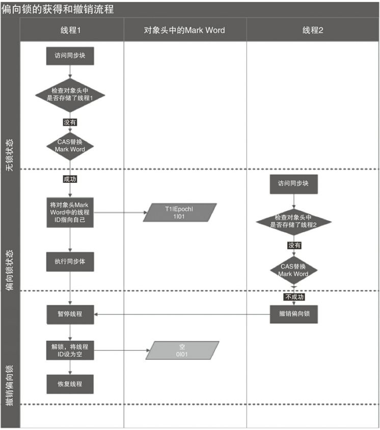
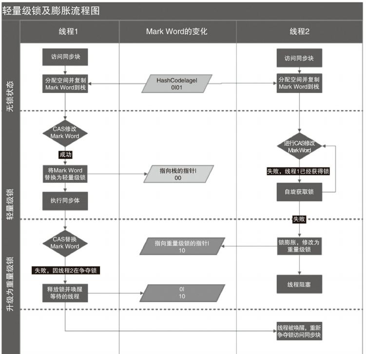

## Java并发机制
---
Java代码在编译后会变成Java字节码，字节码被类加载器加载到JVM里，JVM执行字节 码，最终需要转化为汇编指令在CPU上执行

### volatile
* 轻量级的 synchronized，它在多处理器开发中保证了共享变量的“可见性”(线程修改一个共享变量时，另外一个线程能读到这个修改的值)。

* 如果volatile变量修饰符使用恰当的话，它不会引起线程上下文的切换和调度,比synchronized的使用和执行成本更低。

#### 为什么volatile能提高效率

* `共享变量不会被频繁地写`。因为使用追加字节的方式需要处理器读取更多的字节到高速 缓冲区，这本身就会带来一定的性能消耗，如果共享变量不被频繁写的话，锁的几率也非常小，就没必要通过追加字节的方式来避免相互锁定。

### synchronized

* 重量级锁
* 对于普通同步方法，锁是当前实例对象。
* 对于静态同步方法，锁是当前类的Class对象。
* 对于同步方法块，锁是Synchonized括号里配置的对象。

### Java SE 1.6锁的升级
Java SE 1.6为了减少获得锁和释放锁带来的性能消耗，引入了“偏向锁”和“轻量级锁”，在 Java SE 1.6中，锁一共有4种状态，级别从低到高依次是：`无锁状态、偏向锁状态、轻量级锁状 态和重量级锁状态`，这几个状态会随着竞争情况逐渐升级。`锁可以升级但不能降级`，意味着偏 向锁升级成轻量级锁后不能降级成偏向锁。这种锁升级却不能降级的策略，`目的是为了提高获得锁和释放锁的效率`

#### 偏向锁
大多数情况下，锁不仅不存在多线程竞争，而且总是由同一线程多次获得，为了让线程获得锁的代价更低而引入了偏向锁。当一个线程访问同步块并获取锁时，会在对象头和栈帧中的锁记录里存储锁偏向的线程ID，以后该线程在进入和退出同步块时不需要进行CAS操作来加锁和解锁，只需简单地测试一下对象头的Mark Word里是否存储着指向当前线程的偏向锁。如果测试成功，表示线程已经获得了锁。如果测试失败，则需 要再测试一下Mark Word中偏向锁的标识是否设置成1（表示当前是偏向锁）：如果没有设置，则使用CAS竞争锁；如果设置了，则尝试使用CAS将对象头的偏向锁指向当前线程。

* 获取与释放的过程

* 关闭偏向锁

偏向锁在Java 6和Java 7里是默认启用的，但是它在应用程序启动几秒钟之后才激活，如有必要可以使用JVM参数来关闭延迟：-XX:BiasedLockingStartupDelay=0。如果你确定应用程 序里所有的锁通常情况下处于竞争状态，可以通过JVM参数关闭偏向锁：-XX:- UseBiasedLocking=false，那么程序默认会进入轻量级锁状态。

#### 轻量级锁

* 因为自旋会消耗CPU，为了避免无用的自旋（比如获得锁的线程被阻塞住了），一旦锁升级 成重量级锁，就不会再恢复到轻量级锁状态。当锁处于这个状态下，其他线程试图获取锁时，都会被阻塞住，当持有锁的线程释放锁之后会唤醒这些线程，被唤醒的线程就会进行新一轮的夺锁之争。

#### 各锁的优缺点

### Java如何实现原子操作

* 在Java中可以通过锁和循环CAS的方式来实现原子操作。从Java 1.5开始，JDK的并发包里提供了一些类来支持原子操作，如AtomicBoolean（用原子 方式更新的boolean值）、AtomicInteger（用原子方式更新的int值）和AtomicLong（用原子方式更 新的long值）。这些原子包装类还提供了有用的工具方法，比如以原子的方式将当前值自增1和 自减1。

#### CAS实现原子操作的三大问题

* `ABA问题`。因为CAS需要在操作值的时候，检查值有没有发生变化，如果没有发生变化 则更新，但是如果一个值原来是A，变成了B，又变成了A，那么使用CAS进行检查时会发现它 的值没有发生变化，但是实际上却变化了。ABA问题的解决思路就是使用版本号。在变量前面 追加上版本号，每次变量更新的时候把版本号加1，那么A→B→A就会变成1A→2B→3A。从 Java 1.5开始，JDK的Atomic包里提供了一个类AtomicStampedReference来解决ABA问题。

* `循环时间长开销大`。自旋CAS如果长时间不成功，会给CPU带来非常大的执行开销。如
果JVM能支持处理器提供的pause指令，那么效率会有一定的提升。

* `只能保证一个共享变量的原子操作`。当对一个共享变量执行操作时，我们可以使用循 环CAS的方式来保证原子操作，但是对多个共享变量操作时，循环CAS就无法保证操作的原子 性，这个时候就可以用锁。还有一个取巧的办法，就是把多个共享变量合并成一个共享变量来 操作。比如，有两个共享变量i＝2，j=a，合并一下ij=2a，然后用CAS来操作ij。

